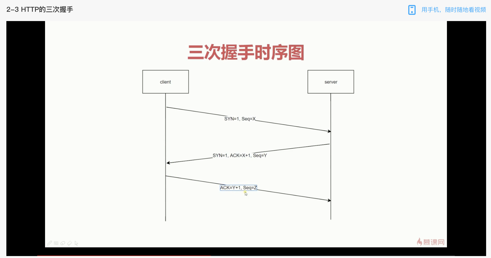

#### 跨域(浏览器同源策略)

协议域名端口号不同
以下无法获取:
cookie localstorage
DOM 元素
ajax

实现跨域：
script 标签
jsonp
cors(跨域资源共享)
postMessage
proxy
nginx 代理
websocket

#### 浏览器输入网址后发生了什么？

1.解析域名(通过 DNS 获取对应 ip 地址)

2.创建 TCP 链接

3.浏览器发送 http 请求

4.服务器处理请求

5.服务器返回 html

6.浏览器处理 html

##### TCP 三次握手(创建 tcp 链接(链接：客户端和服务端传输数据的通道))

所谓三次握手（Three-Way Handshake）即建立 TCP 连接，是指建立一个 TCP 连接时，需要客户端和服务端总共发送 3 个包以确认连接的建立；
为什么需要三次握手：为了规避网络延迟导致的服务器开销问题，双方确认自己与对方的发送与接收是正常的；

SYN：请求同步
ACK：确认同步
seq：初始化序列号

#### TCP 四次挥手

四次挥手即终止 TCP 连接，就是指断开一个 TCP 连接时，需要客户端和服务端总共发送 4 个包以确认连接的断开。在 socket 编程中，这一过程由客户端或服务端任一方执行 close 来触发

FIN：请求关闭连接

#### 为什么连接的时候是三次握手，关闭的时候却是四次握手？

建立连接时因为当 Server 端收到 Client 端的 SYN 连接请求报文后，可以直接发送 SYN+ACK 报文。其中 ACK 报文是用来应答的，SYN 报文是用来同步的。所以建立连接只需要三次握手。

关闭连接时，服务器收到对方的 FIN 报文时，仅仅表示对方不再发送数据了但是还能接收数据，而自己也未必全部数据都发送给对方了,所以服务器可以立即关闭，也可以发送一些数据给对方后，再发送 FIN 报文给对方来表示同意现在关闭连接。因此，服务器 ACK 和 FIN 一般都会分开发送，从而导致多了一次。

#### XSS 跨站脚本攻击

在数据中插入 js 代码，获取用户信息
反射型：
url 参数注入
储存型：
储存到数据库后读取时注入

#### CSRF 跨站请求伪造

在其他网站对目标网站发起请求
防御措施:
token 验证
referer 验证
隐藏令牌

#### 浏览器内核

Trident： 这种浏览器内核是 IE 浏览器用的内核，因为在早期 IE 占有大量的市场份额，所以这种内核比较流行，以前有很多网页也是根据这个内核的标准来编写的，但是实际上这个内核对真正的网页标准支持不是很好。但是由于 IE 的高市场占有率，微软也很长时间没有更新 Trident 内核，就导致了 Trident 内核和 W3C 标准脱节。还有就是 Trident 内核的大量 Bug 等安全问题没有得到解决，加上一些专家学者公开自己认为 IE 浏览器不安全的观点，使很多用户开始转向其他浏览器。
Gecko： 这是 Firefox 和 Flock 所采用的内核，这个内核的优点就是功能强大、丰富，可以支持很多复杂网页效果和浏览器扩展接口，但是代价是也显而易见就是要消耗很多的资源，比如内存。
Presto： Opera 曾经采用的就是 Presto 内核，Presto 内核被称为公认的浏览网页速度最快的内核，这得益于它在开发时的天生优势，在处理 JS 脚本等脚本语言时，会比其他的内核快 3 倍左右，缺点就是为了达到很快的速度而丢掉了一部分网页兼容性。
Webkit： Webkit 是 Safari 采用的内核，它的优点就是网页浏览速度较快，虽然不及 Presto 但是也胜于 Gecko 和 Trident，缺点是对于网页代码的容错性不高，也就是说对网页代码的兼容性较低，会使一些编写不标准的网页无法正确显示。WebKit 前身是 KDE 小组的 KHTML 引擎，可以说 WebKit 是 KHTML 的一个开源的分支。
Blink： 谷歌在 Chromium Blog 上发表博客，称将与苹果的开源浏览器核心 Webkit 分道扬镳，在 Chromium 项目中研发 Blink 渲染引擎（即浏览器核心），内置于 Chrome 浏览器之中。其实 Blink 引擎就是 Webkit 的一个分支，就像 webkit 是 KHTML 的分支一样。Blink 引擎现在是谷歌公司与 Opera Software 共同研发，上面提到过的，Opera 弃用了自己的 Presto 内核，加入 Google 阵营，跟随谷歌一起研发 Blink。
