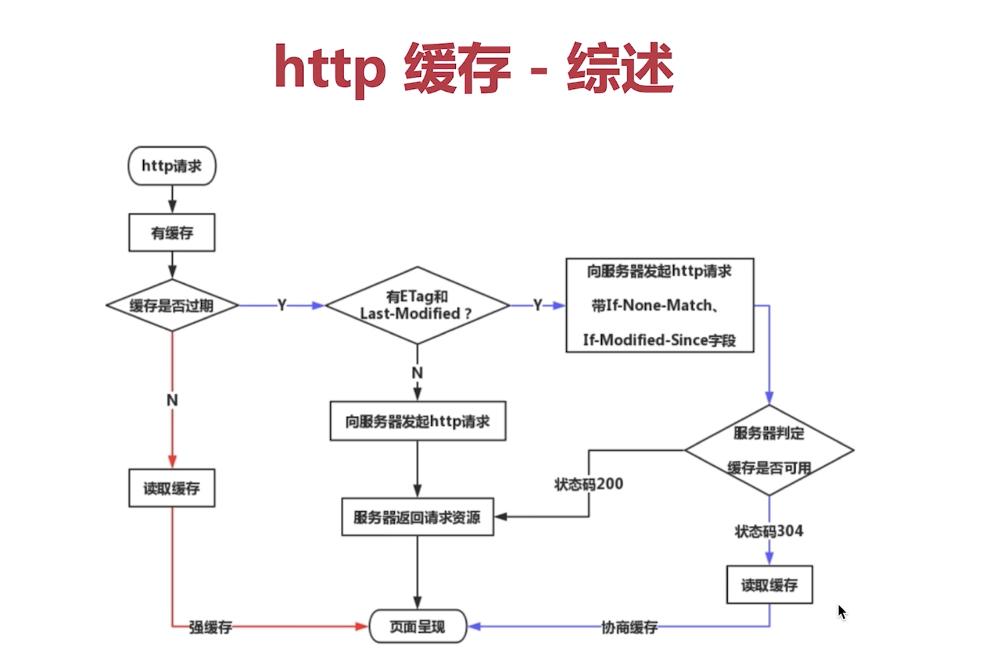

# 浏览器缓存

#### 强缓存

      Cache-Control:
        max-age: 设置缓存最大时间,超过时间则请求网络,否则从缓存中获取资源,优先级高于Expires.
        s-max-age: 设置public(CDN)缓存最大时间,优先级高于max-age
        private: 私人缓存,客户端
        public: 公共缓存,CDN
        no-cache: 不使用强制缓存，使用协商缓存，向浏览器发请求查询缓存是否过期
        no-store: 不进行缓存
      Expires(http1.0):
        缓存过期时间,用来指定资源到期的时间点,是服务器端的具体时间点.告诉浏览器在过期时间前浏览器可以直接从缓存取数据,而无需再次请求.优先级低于max-age.

#### 协商缓存(服务端校验是否缓存)

      Last-Modified/If-Modified-Since: 上次文件修改时间.
      Etag/If-None-Match: 文件内容hash值.(Etag优先级更高)

#### 服务器设置缓存

Cache-Control(强缓存):
&emsp;&emsp;max-age: 设置缓存最大时间,超过时间则请求网络,否则从缓存中获取资源,优先级高于 Expires.
&emsp;&emsp;s-max-age: 设置 public(CDN)缓存最大时间,优先级高于 max-age
&emsp;&emsp;private: 私人缓存,客户端
&emsp;&emsp;public: 公共缓存,CDN
&emsp;&emsp;no-cache: 获取缓存前先向服务器发起交验，内容修改有修改
&emsp;&emsp;no-store: 不进行缓存

Expires(强缓存)(http1.0): 缓存过期时间,用来指定资源到期的时间点,是服务器端的具体时间点.告诉浏览器在过期时间前浏览器可以直接从缓存取数据,而无需再次请求.优先级低于 max-age.

Last-Modified/If-Modified-Since(协商缓存，上次修改时间): 基于客户端和服务端协商的缓存机制.

Etag/If-None-Match(协商缓存，文件内容 hash): 文件内容 hash 值.

