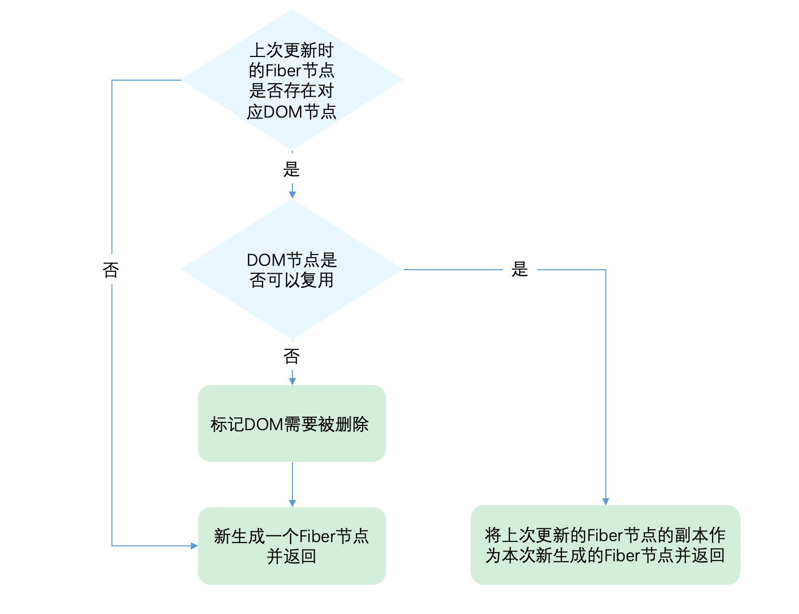

# diff 算法

#### 一个 DOM 节点在某一时刻最多会有 4 个节点和他相关。

1.current Fiber。如果该 DOM 节点已在页面中，current Fiber 代表该 DOM 节点对应的 Fiber 节点。

2.workInProgress Fiber。如果该 DOM 节点将在本次更新中渲染到页面中，workInProgress Fiber 代表该 DOM 节点对应的 Fiber 节点。

3.DOM 节点本身。

4.JSX 对象。即 ClassComponent 的 render 方法的返回结果，或 FunctionComponent 的调用结果。JSX 对象中包含描述 DOM 节点的信息。

Diff 算法的本质是对比 1 和 4，生成 2。

#### Diff 的瓶颈以及 React 如何应对

由于 Diff 操作本身也会带来性能损耗，React 文档中提到，即使在最前沿的算法中，将前后两棵树完全比对的算法的复杂程度为 O(n 3 )，其中 n 是树中元素的数量。

为了降低算法复杂度，React 的 diff 会预设三个限制：

1.只对同级元素进行 Diff。如果一个 DOM 节点在前后两次更新中跨越了层级，那么 React 不会尝试复用他。

2.两个不同类型的元素会产生出不同的树。如果元素由 div 变为 p，React 会销毁 div 及其子孙节点，并新建 p 及其子孙节点。

3.开发者可以通过 key prop 来暗示哪些子元素在不同的渲染下能保持稳定。

#### Diff 是如何实现的

我们从 Diff 的入口函数 reconcileChildFibers 出发，该函数会根据 newChild（即 JSX 对象）类型调用不同的处理函数。

```javascript
// 根据newChild类型选择不同diff函数处理
function reconcileChildFibers(returnFiber: Fiber, currentFirstChild: Fiber | null, newChild: any): Fiber | null {
  const isObject = typeof newChild === 'object' && newChild !== null

  if (isObject) {
    // object类型，可能是 REACT_ELEMENT_TYPE 或 REACT_PORTAL_TYPE
    switch (newChild.$$typeof) {
      case REACT_ELEMENT_TYPE:
      // 调用 reconcileSingleElement 处理
    }
  }

  if (typeof newChild === 'string' || typeof newChild === 'number') {
    // 调用 reconcileSingleTextNode 处理
  }

  if (isArray(newChild)) {
    // 调用 reconcileChildrenArray 处理
  }

  // 一些其他情况调用处理函数

  // 以上都没有命中，删除节点
  return deleteRemainingChildren(returnFiber, currentFirstChild)
}
```

我们可以从同级的节点数量将 Diff 分为两类：

1.当 newChild 类型为 object、number、string，代表同级只有一个节点

2.当 newChild 类型为 Array，同级有多个节点

#### 单节点 diff

对于单个节点，我们以类型 object 为例，会进入 reconcileSingleElement

```javascript
const isObject = typeof newChild === 'object' && newChild !== null

if (isObject) {
  // 对象类型，可能是 REACT_ELEMENT_TYPE 或 REACT_PORTAL_TYPE
  switch (newChild.$$typeof) {
    case REACT_ELEMENT_TYPE:
    // 调用 reconcileSingleElement 处理
  }
}
```



让我们看看第二步`判断 DOM 节点是否可以复用`是如何实现的。

```javascript
function reconcileSingleElement(returnFiber, currentFirstChild, element, lanes) {
  var key = element.key
  var child = currentFirstChild

  // currentFirstChild !== null, 表明是对比更新阶段
  // 遍历 child 树, 直到没有为止(此场景主要是: 更新前有多个节点, 更新后只有一个节点, 需要轮流对比)
  // 首先判断是否存在对应DOM节点
  while (child !== null) {
    // the first item in the list.
    // 上一次更新存在DOM节点，接下来判断是否可复用

    // 首先比较key是否相同
    if (child.key === key) {
      // 1. key相同, 进一步判断 child.elementType === element.type
      switch (child.tag) {
        default: {
          if (
            child.elementType === element.type || // Keep this check inline so it only runs on the false path:
            isCompatibleFamilyForHotReloading(child, element)
          ) {
            // 1.1 elementType 相同, 如果有兄弟节点, 需要给兄弟节点打上Deletion标记
            deleteRemainingChildren(returnFiber, child.sibling)

            // 1.2 构造fiber节点, 新的fiber对象会复用current.stateNode, 即可复用DOM对象
            var _existing3 = useFiber(child, element.props)

            _existing3.ref = coerceRef(returnFiber, child, element)
            _existing3.return = returnFiber

            {
              _existing3._debugSource = element._source
              _existing3._debugOwner = element._owner
            }

            // 返回复用的 fiber
            return _existing3
          }
          // elementType 不同, 跳出 switch
          break
        }
      }

      // key 相同, elementType 不同. 给当前节点以及兄弟节点打上Deletion标记
      deleteRemainingChildren(returnFiber, child)
      break // 结束 while 循环, 创建新的 fiber
    } else {
      // key 不同, 给 current 节点打上删除标记, 继续循环对比, 如果对比不到, 创建新 fiber
      deleteChild(returnFiber, child)
    }

    // 如果 current fiber 有兄弟节点, 获取下一个兄弟 fiber 继续对比
    child = child.sibling
  }

  // 新建 fiber 节点
  if (element.type === REACT_FRAGMENT_TYPE) {
    var created = createFiberFromFragment(element.props.children, returnFiber.mode, lanes, element.key)
    created.return = returnFiber
    return created
  } else {
    var _created4 = createFiberFromElement(element, returnFiber.mode, lanes)

    _created4.ref = coerceRef(returnFiber, currentFirstChild, element)
    _created4.return = returnFiber
    return _created4
  }
}
```

从代码可以看出，React 通过先判断 key 是否相同，如果 key 相同则判断 type 是否相同，只有都相同时一个 DOM 节点才能复用。

这里有个细节需要关注下：

    1.当 child !== null 且 key 相同且 type 不同时执行 deleteRemainingChildren 将 child 及其兄弟 fiber 都标记删除。
    2.当 child !== null 且 key 不同时仅将 child 标记删除。

考虑如下例子：

当前页面有 3 个 li，我们要全部删除，再插入一个 p。

```javascript
// 当前页面显示的
ul > li * 3

// 这次需要更新的
ul > p
```

由于本次更新时只有一个 p，属于单一节点的 Diff，会走上面介绍的代码逻辑。

在 reconcileSingleElement 中遍历之前的 3 个 fiber（对应的 DOM 为 3 个 li），寻找本次更新的 p 是否可以复用之前的 3 个 fiber 中某个的 DOM。

当 key 相同且 type 不同时，代表我们已经找到本次更新的 p 对应的上次的 fiber，但是 p 与 li type 不同，不能复用。既然唯一的可能性已经不能复用，则剩下的 fiber 都没有机会了，所以都需要标记删除。

当 key 不同时只代表遍历到的该 fiber 不能被 p 复用，后面还有兄弟 fiber 还没有遍历到。所以仅仅标记该 fiber 删除。

#### 多节点 diff

同级多个节点的 Diff 的情况:

1.节点属性或者类型更新

2.节点新增或减少

3.节点位置变化

##### Diff 的思路

> Diff 会优先判断当前节点是否属于更新, 因为在日常开发中，相较于新增和删除，更新组件发生的频率更高

> 注意:
>
> 在我们做数组相关的算法题时，经常使用双指针从数组头和尾同时遍历以提高效率，但是这里却不行。
>
> 虽然本次更新的 JSX 对象 newChildren 为数组形式，但是和 newChildren 中每个组件进行比较的是 current fiber，同级的 Fiber 节点是由 sibling 指针链接形成的单链表，即不支持双指针遍历。
>
> 即 newChildren[0]与 fiber 比较，newChildren[1]与 fiber.sibling 比较。
>
> 所以无法使用双指针优化。

基于以上原因，Diff 算法的整体逻辑会经历两轮遍历：

第一轮遍历：处理更新的节点(节点属性, 类型变化).

第二轮遍历：处理剩下的不属于更新的节点(增, 删, 移).

```javascript
  function reconcileChildrenArray(returnFiber, currentFirstChild, newChildren, lanes) {
    var resultingFirstChild = null; // 处理完的 fiber 链表
    var previousNewFiber = null; // 上次对比处理过的新节点(关联兄弟节点)
    var oldFiber = currentFirstChild; // 正在对比的 current fiber
    var lastPlacedIndex = 0; // 上一次匹配到的可复用节点在 oldFiber 中的 index
    var newIdx = 0; // 当前遍历到的 jsx 的 index
    var nextOldFiber = null; // 下一个要对比的 current fiber

    /* 1. 第一轮遍历：处理更新的节点(节点属性, 类型变化) */
    for (; oldFiber !== null && newIdx < newChildren.length; newIdx++) {
      if (oldFiber.index > newIdx) {
        nextOldFiber = oldFiber;
        oldFiber = null;
      } else {
        // 储存将要匹配的下一个 oldFiber
        nextOldFiber = oldFiber.sibling;
      }
      // new react element 和 old fiber 进行比较, 如果key不同, 返回null
      // key 相同, 比较 type 是否一致. type 一致则执行 useFiber(update 逻辑), type 不一致则运行 createXXX(insert 逻辑)
      var newFiber = updateSlot(returnFiber, oldFiber, newChildren[newIdx], lanes);

      if (newFiber === null) {
        if (oldFiber === null) {
          oldFiber = nextOldFiber;
        }
        // newFiber 为 null 即 key 不同导致不可复用, 跳过 for 循环继续执行(key 不同可能是节点有删除,
        // 移动操作, 不属于更新了, 所以放到第二轮遍历去处理)
        break;
      }

      if (shouldTrackSideEffects) {
        // 如果新的 fiber 节点没有通过复用老的 fiber 节点创建的, alternate 为 null, 此时要给老节点打上删除标记, 以后删除 current fiber
        // 如果新的 fiber 节点是通过复用老的 fiber 节点创建的, alternate 不为 null, 保留 current fiber
        if (oldFiber && newFiber.alternate === null) {
          deleteChild(returnFiber, oldFiber);
        }
      }

      // 更新本次遍历到的新节点对应在 oldFiber 中的位置, 新节点添加插入标记
      lastPlacedIndex = placeChild(newFiber, lastPlacedIndex, newIdx); 

      if (previousNewFiber === null) {
        // 第一次遍历时, previousNewFiber 为 null, 此时需要将第一个处理完的 fiber 赋值给 resultingFirstChild
        resultingFirstChild = newFiber;
      } else {
        // 将新生成的 fiber 添加到已经处理后的 fiber 后面(变相更新 resultingFirstChild)
        previousNewFiber.sibling = newFiber;
      }

      previousNewFiber = newFiber;
      oldFiber = nextOldFiber;
    }
    /* 第一次遍历结束 */

    /* 处理第一次遍历后的结果 */
    // 如果 newChildren 序列被遍历完, 那么 oldFiber 序列中剩余节点都视为删除(处理结束, 返回 resultingFirstChild)
    if (newIdx === newChildren.length) {
      deleteRemainingChildren(returnFiber, oldFiber);
      return resultingFirstChild;
    }

    // 如果 oldFiber 序列被遍历完, 那么 newChildren 序列中剩余节点都视为新增(处理结束, 返回 resultingFirstChild)
    if (oldFiber === null) {
      for (; newIdx < newChildren.length; newIdx++) {
        // 剩余的节点创建 fiber
        var _newFiber = createChild(returnFiber, newChildren[newIdx], lanes);

        if (_newFiber === null) {
          continue;
        }

        // 更新本次遍历到的新节点对应在 oldFiber 中的位置, 新节点添加插入标记
        lastPlacedIndex = placeChild(_newFiber, lastPlacedIndex, newIdx);

        if (previousNewFiber === null) {
          resultingFirstChild = _newFiber;
        } else {
          // 将新生成的 fiber 添加到已经处理后的 fiber 后面(变相更新 resultingFirstChild)
          previousNewFiber.sibling = _newFiber;
        }

        previousNewFiber = _newFiber;
      }

      return resultingFirstChild;
    } 


    // 获取 oldFiber 以后的 fiber, 以 oldFiber 的 key 为 key, oldFiber 为 value 组成 Map
    var existingChildren = mapRemainingChildren(returnFiber, oldFiber); // Keep scanning and use the map to restore deleted items as moves.
    /* 处理第一次遍历后的结果结束 */

    // 2. 第二轮遍历：处理剩下的不属于更新的节点(增, 删, 移), 优先复用 oldFiber 序列中的节点
    for (; newIdx < newChildren.length; newIdx++) {
      // 从 existingChildren 匹配 key 复用/创建 fiber
      var _newFiber2 = updateFromMap(existingChildren, returnFiber, newIdx, newChildren[newIdx], lanes);

      if (_newFiber2 !== null) {
        if (shouldTrackSideEffects) {
          if (_newFiber2.alternate !== null) {
            // 如果匹配到了 oldFiber, 将其从列表中删除
            existingChildren.delete(_newFiber2.key === null ? newIdx : _newFiber2.key);
          }
        }

        // 更新本次遍历到的新节点对应在 oldFiber 中的位置, 新节点添加插入标记
        lastPlacedIndex = placeChild(_newFiber2, lastPlacedIndex, newIdx);

        if (previousNewFiber === null) {
          resultingFirstChild = _newFiber2;
        } else {
          previousNewFiber.sibling = _newFiber2;
        }

        previousNewFiber = _newFiber2;
      }
    }

    if (shouldTrackSideEffects) {
      // newChildren 已经遍历完, 那么 oldFiber 序列中剩余节点都视为删除(打上Deletion标记)
      existingChildren.forEach(function (child) {
        return deleteChild(returnFiber, child);
      });
    }

    return resultingFirstChild;
  }
```

##### 第一轮遍历, 处理更新的节点(节点属性, 类型变化)

1.let i = 0，遍历 newChildren，将 newChildren[i]与 oldFiber 比较，判断 DOM 节点是否可复用。

2.如果可复用，i++，继续比较 newChildren[i]与 oldFiber.sibling，可以复用则继续遍历。

3.如果不可复用，分两种情况：

    - key 不同导致不可复用，立即跳出整个遍历，第一轮遍历结束.

    - key 相同 type 不同导致不可复用，会将 oldFiber 标记为 DELETION，并继续遍历.

4.如果 newChildren 遍历完（即 i === newChildren.length - 1）或者 oldFiber 遍历完（即 oldFiber.sibling === null），跳出遍历，第一轮遍历结束。

当遍历结束后，会有两种结果：

1.步骤 3 跳出的遍历:

此时 newChildren 没有遍历完，oldFiber 也没有遍历完。
例如:

```javascript
// 之前
<li key="0">0</li>
<li key="1">1</li>
<li key="2">2</li>

// 之后
<li key="0">0</li>
<li key="2">1</li>
<li key="1">2</li>
```

第一个节点可复用，遍历到 key === 2 的节点发现 key 改变，不可复用，跳出遍历，等待第二轮遍历处理。

此时 oldFiber 剩下 key === 1、key === 2 未遍历，newChildren 剩下 key === 2、key === 1 未遍历。

2.步骤 4 跳出的遍历

可能 newChildren 遍历完，或 oldFiber 遍历完，或他们同时遍历完。
例如:

```javascript
// 之前
<li key="0" className="a">0</li>
<li key="1" className="b">1</li>

// 之后 情况1 —— newChildren与oldFiber都遍历完
<li key="0" className="aa">0</li>
<li key="1" className="bb">1</li>

// 之后 情况2 —— newChildren没遍历完，oldFiber遍历完
// newChildren剩下 key==="2" 未遍历
<li key="0" className="aa">0</li>
<li key="1" className="bb">1</li>
<li key="2" className="cc">2</li>

// 之后 情况3 —— newChildren遍历完，oldFiber没遍历完
// oldFiber剩下 key==="1" 未遍历
<li key="0" className="aa">0</li>
```

带着第一轮遍历的结果，我们开始第二轮遍历。

##### 第二轮遍历, 处理剩下的不属于更新的节点(增, 删, 移)

对于第一轮遍历的结果，我们分别讨论：

1.newChildren 与 oldFiber 同时遍历完

那就是最理想的情况：只需在第一轮遍历进行组件更新 (opens new window)。此时 Diff 结束。

2.newChildren 没遍历完，oldFiber 遍历完

已有的 DOM 节点都复用了，这时还有新加入的节点，意味着本次更新有新节点插入，我们只需要遍历剩下的 newChildren 为生成的 workInProgress fiber 依次标记 Placement，处理结束。

3.newChildren 遍历完，oldFiber 没遍历完

意味着本次更新比之前的节点数量少，有节点被删除了。所以需要遍历剩下的 oldFiber，依次标记 Deletion，处理结束。

4.newChildren 与 oldFiber 都没遍历完

这意味着有节点在这次更新中改变了位置。

##### 处理移动的节点

为了快速的找到 key 对应的 oldFiber，我们将所有还未处理的 oldFiber 存入以 key 为 key，oldFiber 为 value 的 Map 中。

```javascript
const existingChildren = mapRemainingChildren(returnFiber, oldFiber)
```

接下来遍历剩余的 newChildren，通过 newChildren[i].key 就能在 existingChildren 中找到 key 相同的 oldFiber。

##### 标记节点是否移动

既然我们的目标是寻找移动的节点，那么我们需要明确：节点是否移动是以什么为参照物？

我们的参照物是：最后一个可复用的节点在 oldFiber 中的位置索引（用变量 lastPlacedIndex 表示）。

由于本次更新中节点是按 newChildren 的顺序排列。在遍历 newChildren 过程中，每个遍历到的可复用节点一定是当前遍历到的所有可复用节点中最靠右的那个，即一定在 lastPlacedIndex 对应的可复用的节点在本次更新中位置的后面。

那么我们只需要比较遍历到的可复用节点在上次更新时是否也在 lastPlacedIndex 对应的 oldFiber 后面，就能知道两次更新中这两个节点的相对位置改变没有。

我们用变量 oldIndex 表示遍历到的可复用节点在 oldFiber 中的位置索引。如果 oldIndex < lastPlacedIndex，代表本次更新该节点需要向右移动。

lastPlacedIndex 初始为 0，每遍历一个可复用的节点，如果 oldIndex >= lastPlacedIndex，则 lastPlacedIndex = oldIndex。
