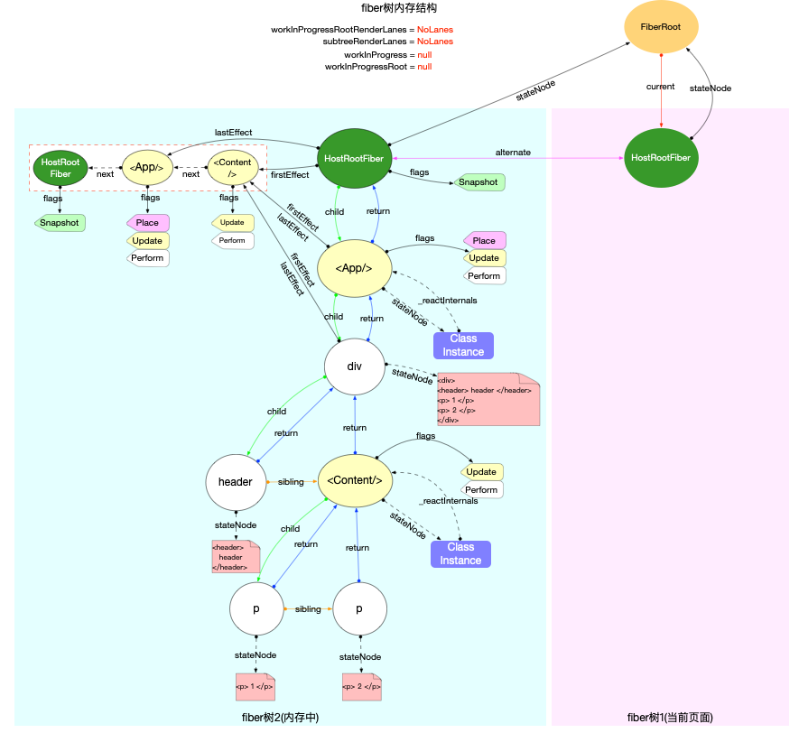
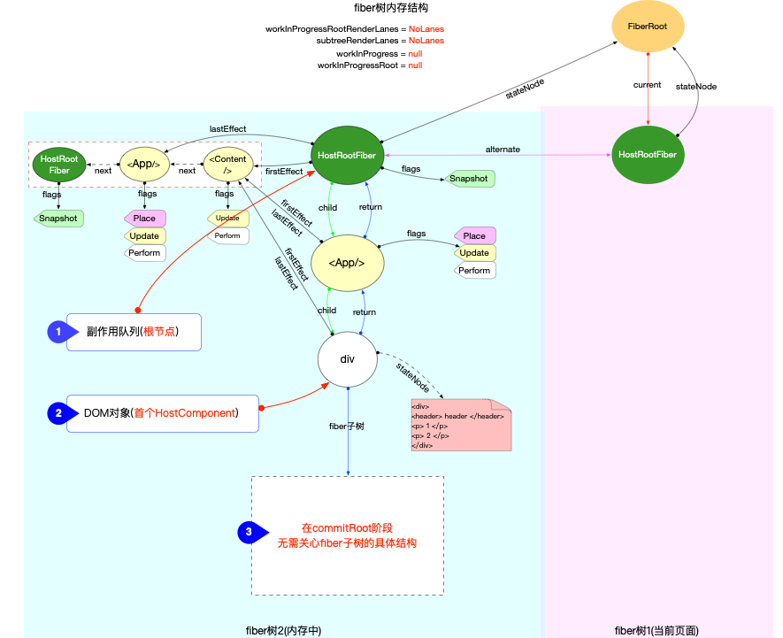
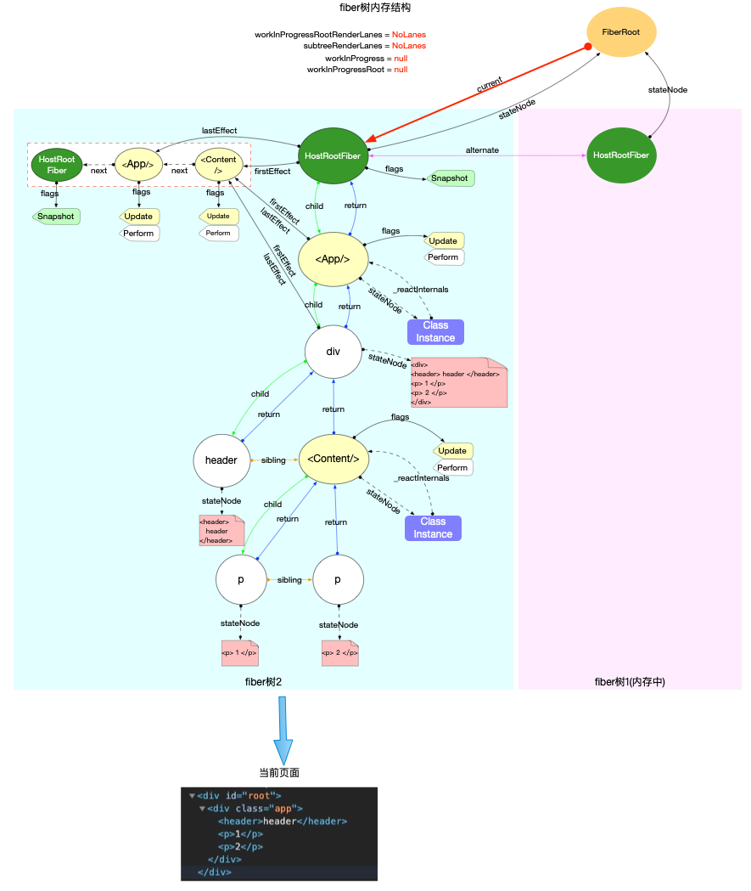
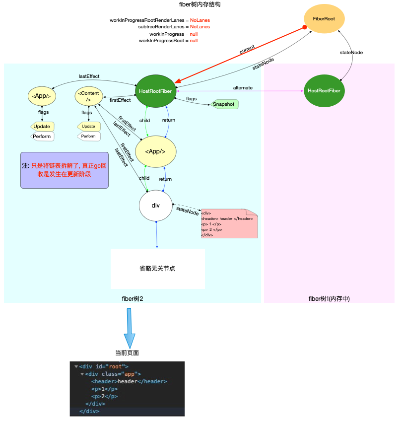

# fiber树构造 commit 阶段

#### commitRoot
```javascript
function commitRoot(root) {
  const renderPriorityLevel = getCurrentPriorityLevel();
  runWithPriority(
    ImmediateSchedulerPriority,
    commitRootImpl.bind(null, root, renderPriorityLevel),
  );
  return null;
}
```

在commitRoot中同时使用到了渲染优先级和调度优先级, 有关优先级的讨论, 在前文已经做出了说明(参考React 中的优先级管理和fiber 树构造(基础准备)#优先级). 最后的实现是通过commitRootImpl函数:
```javascript
function commitRootImpl(root, renderPriorityLevel) {
  // ============ 渲染前: 准备 ============

  const finishedWork = root.finishedWork;
  const lanes = root.finishedLanes;

  // 清空FiberRoot对象上的属性
  root.finishedWork = null;
  root.finishedLanes = NoLanes;
  root.callbackNode = null;

  if (root === workInProgressRoot) {
    // 重置全局变量
    workInProgressRoot = null;
    workInProgress = null;
    workInProgressRootRenderLanes = NoLanes;
  }

  // 再次更新副作用队列
  let firstEffect;
  if (finishedWork.flags > PerformedWork) {
    // 默认情况下fiber节点的副作用队列是不包括自身的
    // 如果根节点有副作用, 则将根节点添加到副作用队列的末尾
    if (finishedWork.lastEffect !== null) {
      finishedWork.lastEffect.nextEffect = finishedWork;
      firstEffect = finishedWork.firstEffect;
    } else {
      firstEffect = finishedWork;
    }
  } else {
    firstEffect = finishedWork.firstEffect;
  }

  // ============ 渲染 ============
  let firstEffect = finishedWork.firstEffect;
  if (firstEffect !== null) {
    const prevExecutionContext = executionContext;
    executionContext |= CommitContext;
    // 阶段1: dom突变之前
    nextEffect = firstEffect;
    do {
      commitBeforeMutationEffects();
    } while (nextEffect !== null);

    // 阶段2: dom突变, 界面发生改变
    nextEffect = firstEffect;
    do {
      commitMutationEffects(root, renderPriorityLevel);
    } while (nextEffect !== null);
    // 恢复界面状态
    resetAfterCommit(root.containerInfo);
    // 切换current指针
    root.current = finishedWork;

    // 阶段3: layout阶段, 调用生命周期componentDidUpdate和回调函数等
    nextEffect = firstEffect;
    do {
      commitLayoutEffects(root, lanes);
    } while (nextEffect !== null);
    nextEffect = null;
    executionContext = prevExecutionContext;
  }

  // ============ 渲染后: 重置与清理 ============
  if (rootDoesHavePassiveEffects) {
    // 有被动作用(使用useEffect), 保存一些全局变量
  } else {
    // 分解副作用队列链表, 辅助垃圾回收
    // 如果有被动作用(使用useEffect), 会把分解操作放在flushPassiveEffects函数中
    nextEffect = firstEffect;
    while (nextEffect !== null) {
      const nextNextEffect = nextEffect.nextEffect;
      nextEffect.nextEffect = null;
      if (nextEffect.flags & Deletion) {
        detachFiberAfterEffects(nextEffect);
      }
      nextEffect = nextNextEffect;
    }
  }
  // 重置一些全局变量(省略这部分代码)...
  // 下面代码用于检测是否有新的更新任务
  // 比如在componentDidMount函数中, 再次调用setState()

  // 1. 检测常规(异步)任务, 如果有则会发起异步调度(调度中心`scheduler`只能异步调用)
  ensureRootIsScheduled(root, now());
  // 2. 检测同步任务, 如果有则主动调用flushSyncCallbackQueue(无需再次等待scheduler调度), 再次进入fiber树构造循环
  flushSyncCallbackQueue();

  return null;
}
```

#### 渲染前

为接下来正式渲染, 做一些准备工作. 主要包括:

1.设置全局状态(如: 更新fiberRoot上的属性)

2.重置全局变量(如: workInProgressRoot, workInProgress等)

3.再次更新副作用队列: 只针对根节点fiberRoot.finishedWork
    - 默认情况下根节点的副作用队列是不包括自身的, 如果根节点有副作用, 则将根节点添加到副作用队列的末尾
    - 注意只是延长了副作用队列, 但是fiberRoot.lastEffect指针并没有改变. 比如首次构造时, 根节点拥有Snapshot标记:




#### 渲染中

> commitRootImpl函数中, 渲染阶段的主要逻辑是处理副作用队列, 将最新的 DOM 节点(已经在内存中, 只是还没渲染)渲染到界面上.

整个渲染过程被分为 3 个函数分布实现:

1.commitBeforeMutationEffects
    - dom 变更之前, 处理副作用队列中带有 Snapshot, Passive 标记的fiber节点.

2.commitMutationEffects
    - dom 变更, 界面得到更新. 处理副作用队列中带有Placement, Update(useLayoutEffect 执行销毁函数), Deletion, Hydrating标记的fiber节点.

3.commitLayoutEffects
    - dom 变更后, 处理副作用队列中带有Update | Callback标记的fiber节点.


通过上述源码分析, 可以把commitRootImpl的职责概括为 2 个方面:

1.处理副作用队列. (步骤 1,2,3 都会处理, 只是处理节点的标识fiber.flags不同).

2.调用渲染器, 输出最终结果. (在步骤 2: commitMutationEffects中执行).

所以commitRootImpl是处理fiberRoot.finishedWork这棵即将被渲染的fiber树, 理论上无需关心这棵fiber树是如何产生的(可以是首次构造产生, 也可以是对比更新产生). 为了清晰简便, 在下文的所有图示都使用初次创建的fiber树结构来进行演示.


这 3 个函数处理的对象是副作用队列和DOM对象.

所以无论fiber树结构有多么复杂, 到了commitRoot阶段, 实际起作用的只有 2 个节点:
    - 副作用队列所在节点: 根节点, 即HostRootFiber节点.
    - DOM对象所在节点: 从上至下首个HostComponent类型的fiber节点, 此节点 fiber.stateNode实际上指向最新的 DOM 树.


下图为了清晰, 省略了一些无关引用, 只留下commitRoot阶段实际会用到的fiber节点:




#### commitBeforeMutationEffects

第一阶段: dom 变更之前, 处理副作用队列中带有 Snapshot, Passive 标记的 fiber 节点.
```javascript
function commitBeforeMutationEffects() {
  while (nextEffect !== null) {
    var current = nextEffect.alternate;
    var flags = nextEffect.flags;

    // 处理`Snapshot`标记(调用 getSnapshotBeforeUpdate)
    if ((flags & Snapshot) !== NoFlags) {
      setCurrentFiber(nextEffect);
      commitBeforeMutationLifeCycles(current, nextEffect);
      resetCurrentFiber();
    }

    // 处理`Passive`标记(调度 useEffect)
    if ((flags & Passive) !== NoFlags) {
      // If there are passive effects, schedule a callback to flush at
      // the earliest opportunity.
      // Passive 标记只在使用了 hook, useEffect 会出现.(添加 useEffect 到任务队列)
      if (!rootDoesHavePassiveEffects) {
        rootDoesHavePassiveEffects = true;
        scheduleCallback(NormalPriority$1, function () {
          flushPassiveEffects(); // 执行 effect 回调函数
          return null;
        });
      }
    }

    nextEffect = nextEffect.nextEffect;
  }
}
```

1.处理 Snapshot 标记(commitBeforeMutationLifeCycles 函数)(调用 getSnapshotBeforeUpdate 生命周期钩子)

从源码中可以看到, 与 Snapshot 标记相关的类型只有 ClassComponent 和 HostRoot.

    - 对于 ClassComponent 类型节点, 调用了 instance.getSnapshotBeforeUpdate 生命周期函数
    - 对于 HostRoot 类型节点, 调用 clearContainer 清空了容器节点(即 div#root 这个 dom 节点).

2.处理 Passive 标记(调度useEffect)

Passive 标记只会在使用了 hook 对象的 function 类型的节点上存在, 后续的执行过程在 hook 原理章节中详细说明. 此处我们需要了解在 commitRoot 的第一个阶段, 为了处理 hook 对象(如 useEffect), 通过scheduleCallback 单独注册了一个调度任务task, 等待调度中心 scheduler 处理.

注意: 通过调度中心 scheduler 调度的任务 task 均是通过 MessageChannel 触发, 都是异步执行(可参考 React 调度原理(scheduler)).


#### commitMutationEffects

第二阶段: dom 变更, 界面得到更新. 处理副作用队列中带有ContentReset, Ref, Placement, Update, Deletion, Hydrating标记的fiber节点.
```javascript
function commitMutationEffects(root, renderPriorityLevel) {
  // TODO: Should probably move the bulk of this function to commitWork.
  while (nextEffect !== null) {
    setCurrentFiber(nextEffect);
    var flags = nextEffect.flags;

    // 处理 ContentReset
    if (flags & ContentReset) {
      commitResetTextContent(nextEffect);
    }

    // 处理 Ref
    if (flags & Ref) {
      var current = nextEffect.alternate;

      if (current !== null) {
        // 先清空 ref, 在 commitRoot 的第三阶段(dom变更后), 再重新赋值
        commitDetachRef(current);
      }
    } // The following switch statement is only concerned about placement,
    // updates, and deletions. To avoid needing to add a case for every possible
    // bitmap value, we remove the secondary effects from the effect tag and
    // switch on that value.


    var primaryFlags = flags & (Placement | Update | Deletion | Hydrating);

    // 处理 DOM 突变
    switch (primaryFlags) {
      // 新增节点
      case Placement:
        {
          commitPlacement(nextEffect); // Clear the "placement" from effect tag so that we know that this is
          // inserted, before any life-cycles like componentDidMount gets called.
          // TODO: findDOMNode doesn't rely on this any more but isMounted does
          // and isMounted is deprecated anyway so we should be able to kill this.

          // 清除标记
          nextEffect.flags &= ~Placement;
          break;
        }

      case PlacementAndUpdate:
        {
          // Placement
          commitPlacement(nextEffect); // Clear the "placement" from effect tag so that we know that this is
          // inserted, before any life-cycles like componentDidMount gets called.

          nextEffect.flags &= ~Placement; // Update

          var _current = nextEffect.alternate;
          commitWork(_current, nextEffect);
          break;
        }

      case Hydrating:
        {
          nextEffect.flags &= ~Hydrating;
          break;
        }

      case HydratingAndUpdate:
        {
          nextEffect.flags &= ~Hydrating; // Update

          var _current2 = nextEffect.alternate;
          commitWork(_current2, nextEffect);
          break;
        }

      case Update:
        {
          var _current3 = nextEffect.alternate;
          commitWork(_current3, nextEffect);
          break;
        }

      case Deletion:
        {
          commitDeletion(root, nextEffect);
          break;
        }
    }

    resetCurrentFiber();
    nextEffect = nextEffect.nextEffect;
  }
}
```
处理 DOM 突变:

1.新增: 函数调用栈 commitPlacement -> insertOrAppendPlacementNode -> appendChild

2.更新: 函数调用栈 commitWork -> commitUpdate
```javascript
function commitWork(current, finishedWork) {
  switch (finishedWork.tag) {
    case FunctionComponent:
      // 当fiber.tag为FunctionComponent，会调用commitHookEffectListUnmount.
      // 该方法会遍历effectList，执行所有useLayoutEffect hook的销毁函数.
      commitHookEffectListUnmount(Layout | HasEffect, finishedWork);
      return
    case HostComponent:
    var instance = finishedWork.stateNode;

        if (instance != null) {
          // Commit the work prepared earlier.
          var newProps = finishedWork.memoizedProps; // For hydration we reuse the update path but we treat the oldProps
          // as the newProps. The updatePayload will contain the real change in
          // this case.

          var oldProps = current !== null ? current.memoizedProps : newProps;
          var type = finishedWork.type; // TODO: Type the updateQueue to be specific to host components.

          var updatePayload = finishedWork.updateQueue;
          finishedWork.updateQueue = null;

          if (updatePayload !== null) {
            commitUpdate(instance, updatePayload, type, oldProps, newProps);
          }
        }

        return;
  }
}
```
3.删除: 函数调用栈 commitDeletion -> removeChild

最终会调用 appendChild, commitUpdate, removeChild 这些 react-dom 包中的函数. 它们是 HostConfig 协议(源码在 ReactDOMHostConfig.js 中)中规定的标准函数, 在渲染器react-dom包中进行实现. 这些函数就是直接操作 DOM, 所以执行之后, 界面也会得到更新.

注意: commitMutationEffects 执行之后, 在 commitRootImpl 函数中切换当前 fiber 树(root.current = finishedWork),保证 fiberRoot.current 指向代表当前界面的 fiber 树.


#### commitLayoutEffects

第三阶段: dom 变更后, 处理副作用队列中带有 Update, Callback, Ref 标记的 fiber 节点.
```javascript
function commitLayoutEffects(root, committedLanes) {
  while (nextEffect !== null) {
    setCurrentFiber(nextEffect);
    var flags = nextEffect.flags;

    // 处理 Update 和 Callback 标记(调用生命周期钩子和hook)(销毁上次的回调是在渲染中阶段 commitWork 中执行)
    if (flags & (Update | Callback)) {
      var current = nextEffect.alternate;
      commitLifeCycles(root, current, nextEffect);
    }

    if (flags & Ref) {
      // 重新设置ref
      commitAttachRef(nextEffect);
    }

    resetCurrentFiber();
    nextEffect = nextEffect.nextEffect;
  }
}
```
核心处理在 commitLifeCycles 函数中:

1.对于 ClassComponent 节点, 调用生命周期函数 componentDidMount 或 componentDidUpdate, 调用 update.callback 回调函数.

2.对于 HostComponent 节点, 如有 Update 标记, 需要设置一些原生状态(如: focus等)


### 渲染后

执行完上述步骤之后, 本次渲染任务就已经完成了. 在渲染完成后, 需要做一些重置和清理工作:

1.清除副作用队列

    - 由于副作用队列是一个链表, 由于单个 fiber 对象的引用关系, 无法被 gc 回收.
    - 将链表全部拆开, 当 fiber 对象不再使用的时候, 可以被 gc 回收.


2.检测更新

    - 在整个渲染过程中, 有可能产生新的 update (比如在 componentDidMount 函数中, 再次调用 setState()).
    - 如果是常规(异步)任务, 不用特殊处理, 调用 ensureRootIsScheduled 确保任务已经注册到调度中心即可.
    - 如果是同步任务, 则主动调用 flushSyncCallbackQueue (无需再次等待 scheduler 调度), 再次进入 fiber 树构造循环
```javascript
// 清除副作用队列
if (rootDoesHavePassiveEffects) {
  // 有被动作用(使用useEffect), 保存一些全局变量
} else {
  // 分解副作用队列链表, 辅助垃圾回收.
  // 如果有被动作用(使用useEffect), 会把分解操作放在flushPassiveEffects函数中
  nextEffect = firstEffect;
  while (nextEffect !== null) {
    const nextNextEffect = nextEffect.nextEffect;
    nextEffect.nextEffect = null;
    if (nextEffect.flags & Deletion) {
      detachFiberAfterEffects(nextEffect);
    }
    nextEffect = nextNextEffect;
  }
}
// 重置一些全局变量(省略这部分代码)...
// 下面代码用于检测是否有新的更新任务
// 比如在componentDidMount函数中, 再次调用setState()

// 1. 检测常规(异步)任务, 如果有则会发起异步调度(调度中心`scheduler`只能异步调用)
ensureRootIsScheduled(root, now());
// 2. 检测同步任务, 如果有则主动调用flushSyncCallbackQueue(无需再次等待scheduler调度), 再次进入fiber树构造循环
flushSyncCallbackQueue();
```