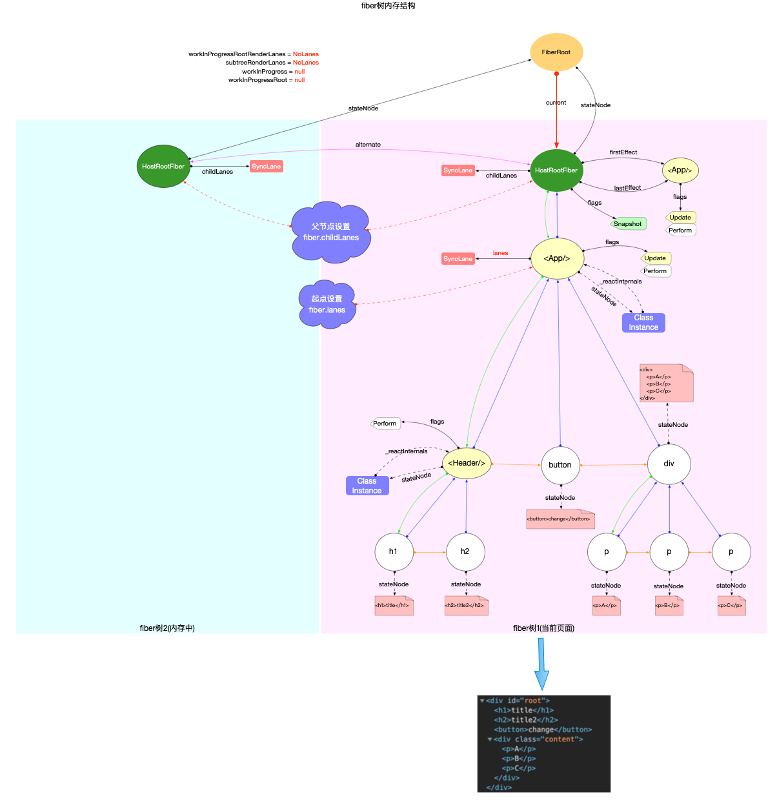

# fiber树构造-更新阶段

#### 3 种更新方式
reconciler 运作流程中总结的 4 个阶段(从输入到输出), 其中承接输入的函数只有 scheduleUpdateOnFiber.在react-reconciler 对外暴露的 api 函数中, 只要涉及到需要改变 fiber 的操作(无论是首次渲染或对比更新), 最后都会间接调用scheduleUpdateOnFiber, scheduleUpdateOnFiber 函数是输入链路中的必经之路.


1.Class组件中调用setState.
```javascript
Component.prototype.setState = function(partialState, callback) {
  this.updater.enqueueSetState(this, partialState, callback, 'setState');
};
```
在fiber 树构造(初次创建)中的beginWork阶段, class 类型的组件初始化完成之后, this.updater对象如下:
```javascript
const classComponentUpdater = {
  isMounted,
  enqueueSetState(inst, payload, callback) {
    // 1. 获取class实例对应的fiber节点
    const fiber = getInstance(inst);
    // 2. 创建update对象
    const eventTime = requestEventTime();
    const lane = requestUpdateLane(fiber); // 确定当前update对象的优先级
    const update = createUpdate(eventTime, lane);
    update.payload = payload;
    if (callback !== undefined && callback !== null) {
      update.callback = callback;
    }
    // 3. 将update对象添加到当前Fiber节点的updateQueue队列当中
    enqueueUpdate(fiber, update);
    // 4. 进入reconciler运作流程中的`输入`环节
    scheduleUpdateOnFiber(fiber, lane, eventTime); // 传入的lane是update优先级
  }
};
```


2.Function组件中调用hook对象暴露出的dispatchAction.
```javascript
function dispatchAction<S, A>(
  fiber: Fiber,
  queue: UpdateQueue<S, A>,
  action: A,
) {
  // 1. 创建update对象
  const eventTime = requestEventTime();
  // 确定当前update对象的优先级
  const lane = requestUpdateLane(fiber); 
  const update: Update<S, A> = {
    lane,
    action,
    eagerReducer: null,
    eagerState: null,
    next: (null: any),
  };
  // 2. 将update对象添加到当前Hook对象的updateQueue队列当中
  const pending = queue.pending;
  if (pending === null) {
    update.next = update;
  } else {
    update.next = pending.next;
    pending.next = update;
  }
  queue.pending = update;
  // 3. 请求调度, 进入reconciler运作流程中的`输入`环节.
  scheduleUpdateOnFiber(fiber, lane, eventTime); // 传入的lane是update优先级
}
```

3.在container节点上重复调用render.
```javascript
ReactDOMBlockingRoot.prototype.render = function (children) {
  var root = this._internalRoot;
  // updateContainer ---> scheduleUpdateOnFiber
  updateContainer(children, root, null, null);
};
```


#### 构造阶段
```javascript
export function scheduleUpdateOnFiber(
  fiber: Fiber, // fiber表示被更新的节点
  lane: Lane, // lane表示update优先级
  eventTime: number,
) {
  const root = markUpdateLaneFromFiberToRoot(fiber, lane);
  if (lane === SyncLane) {
    if (
      (executionContext & LegacyUnbatchedContext) !== NoContext &&
      (executionContext & (RenderContext | CommitContext)) === NoContext
    ) {
      // 初次渲染
      performSyncWorkOnRoot(root);
    } else {
      // 对比更新
      ensureRootIsScheduled(root, eventTime);
    }
  }
  mostRecentlyUpdatedRoot = root;
}
```

对比更新与初次渲染的不同点:

1.markUpdateLaneFromFiberToRoot 函数, 只在对比更新阶段才发挥出它的作用, 它找出了fiber树中受到本次update影响的所有节点, 并设置这些节点的fiber.lanes或fiber.childLanes(在legacy模式下为SyncLane)以备fiber树构造阶段使用.
```javascript
function markUpdateLaneFromFiberToRoot(
  sourceFiber: Fiber, // sourceFiber表示被更新的节点
  lane: Lane, // lane表示update优先级
): FiberRoot | null {
  // 1. 将update优先级设置到sourceFiber.lanes
  sourceFiber.lanes = mergeLanes(sourceFiber.lanes, lane);
  let alternate = sourceFiber.alternate;
  if (alternate !== null) {
    // 同时设置sourceFiber.alternate的优先级
    alternate.lanes = mergeLanes(alternate.lanes, lane);
  }
  // 2. 从sourceFiber开始, 向上遍历所有节点, 直到HostRoot. 设置沿途所有节点(包括alternate)的childLanes
  let node = sourceFiber;
  let parent = sourceFiber.return;
  while (parent !== null) {
    parent.childLanes = mergeLanes(parent.childLanes, lane);
    alternate = parent.alternate;
    if (alternate !== null) {
      alternate.childLanes = mergeLanes(alternate.childLanes, lane);
    }
    node = parent;
    parent = parent.return;
  }
  if (node.tag === HostRoot) {
    const root: FiberRoot = node.stateNode;
    return root;
  } else {
    return null;
  }
}
```

下图表示了 markUpdateLaneFromFiberToRoot 的具体作用:

1.以sourceFiber为起点, 设置起点的fiber.lanes

2.从起点开始, 直到 HostRootFiber, 设置父路径上所有节点(也包括fiber.alternate)的 fiber.childLanes.

3.通过设置 fiber.lanes 和 fiber.childLanes 就可以辅助判断子树是否需要更新(在下文循环构造中详细说明).



注意:

1.fiberRoot.current 指向与当前页面对应的 fiber 树, workInProgress 指向正在构造的fiber树.

2.刷新栈帧会调用 createWorkInProgress(), 使得workInProgress.flags 和 workInProgress.effects 都已经被重置. 且 workInProgress.child = current.child. 所以在进入循环构造之前, HostRootFiber 与 HostRootFiber.alternate共用一个 child (这里是 fiber(<App/>)).


#### 循环构造

回顾一下 fiber 树构造(初次创建)中的介绍. 整个fiber树构造是一个深度优先遍历(可参考React 算法之深度优先遍历), 其中有 2 个重要的变量 workInProgress 和 current (可参考fiber 树构造(基础准备)中介绍的双缓冲技术):

    - workInProgress 和 current都视为指针.
    - workInProgress 指向当前正在构造的 fiber 节点.
    - current = workInProgress.alternate(即fiber.alternate), 指向当前页面正在使用的 fiber 节点.


在深度优先遍历中, 每个fiber节点都会经历 2 个阶段:

1.探寻阶段 beginWork

2.回溯阶段 completeWork

这 2 个阶段共同完成了每一个fiber节点的创建(或更新), 所有 fiber 节点则构成了 fiber 树.
```javascript
function workLoopSync() {
  while (workInProgress !== null) {
    performUnitOfWork(workInProgress);
  }
}

function performUnitOfWork(unitOfWork: Fiber): void {
  // unitOfWork就是被传入的workInProgress
  const current = unitOfWork.alternate;
  let next;
  next = beginWork(current, unitOfWork, subtreeRenderLanes);
  unitOfWork.memoizedProps = unitOfWork.pendingProps;
  if (next === null) {
    // 如果没有派生出新的节点, 则进入completeWork阶段, 传入的是当前unitOfWork
    completeUnitOfWork(unitOfWork);
  } else {
    workInProgress = next;
  }
}
```

注意: 在对比更新过程中 current = unitOfWork.alternate, 不为 null, 后续的调用逻辑中会大量使用此处传入的 current.


#### 探寻阶段 beginWork
```javascript
function beginWork(
  current: Fiber | null,
  workInProgress: Fiber,
  renderLanes: Lanes,
): Fiber | null {
  const updateLanes = workInProgress.lanes;
  if (current !== null) {
    // 进入对比
    const oldProps = current.memoizedProps;
    const newProps = workInProgress.pendingProps;
    if (
      oldProps !== newProps ||
      hasLegacyContextChanged() ||
      (__DEV__ ? workInProgress.type !== current.type : false)
    ) {
      didReceiveUpdate = true;
    } else if (!includesSomeLane(renderLanes, updateLanes)) {
      // 当前渲染优先级renderLanes不包括fiber.lanes, 表明当前fiber节点无需更新
      didReceiveUpdate = false;
      // 当前fiber节点无需更新, 调用 bailoutOnAlreadyFinishedWork 循环检测子节点是否需要更新
      return bailoutOnAlreadyFinishedWork(current, workInProgress, renderLanes);
    }
  }
  // 余下逻辑与初次创建共用
  // 1. 设置workInProgress 优先级为 NoLanes(最高优先级)
  workInProgress.lanes = NoLanes;
  // 2. 根据 workInProgress 节点的类型, 用不同的方法派生出子节点
  switch (workInProgress.tag) {
    case ClassComponent: {
      const Component = workInProgress.type;
      const unresolvedProps = workInProgress.pendingProps;
      const resolvedProps =
        workInProgress.elementType === Component
          ? unresolvedProps
          : resolveDefaultProps(Component, unresolvedProps);
      return updateClassComponent(
        current,
        workInProgress,
        Component,
        resolvedProps,
        renderLanes,
      );
    }
    case HostRoot:
      return updateHostRoot(current, workInProgress, renderLanes);
    case HostComponent:
      return updateHostComponent(current, workInProgress, renderLanes);
    case HostText:
      return updateHostText(current, workInProgress);
    case Fragment:
      return updateFragment(current, workInProgress, renderLanes);
  }
}
```

#### bailout逻辑 {#bailout}

> bail out英文短语翻译为解救, 纾困, 在源码中, bailout 用于判断子树节点是否完全复用, 如果可以复用, 则会略过 fiber 树构造.

与初次创建不同, 在对比更新过程中, 如果是老节点, 那么current !== null, 需要进行对比, 然后决定是否复用老节点及其子树(即bailout逻辑).

1.!includesSomeLane(renderLanes, updateLanes)这个判断分支, 包含了渲染优先级和 update 优先级的比较(详情可以回顾fiber 树构造(基础准备)中优先级相关解读), 如果当前节点无需更新, 则会进入bailout逻辑.

2.最后会调用 bailoutOnAlreadyFinishedWork:

    - 如果同时满足 !includesSomeLane(renderLanes, workInProgress.childLanes), 表明该 fiber 节点及其子树都无需更新, 可直接进入回溯阶段(completeUnitOfWork)
    - 如果不满足 !includesSomeLane(renderLanes, workInProgress.childLanes), 意味着子节点需要更新, clone并返回子节点.
```javascript
function bailoutOnAlreadyFinishedWork(
  current: Fiber | null,
  workInProgress: Fiber,
  renderLanes: Lanes,
): Fiber | null {
  if (!includesSomeLane(renderLanes, workInProgress.childLanes)) {
    // 渲染优先级不包括 workInProgress.childLanes, 表明子节点也无需更新. 返回null, 直接进入回溯阶段(completeUnitOfWork).
    return null;
  } else {
    // 本 fiber 虽然不用更新, 但是子节点需要更新. clone 并返回子节点
    cloneChildFibers(current, workInProgress);
    return workInProgress.child;
  }
}
```

注意: cloneChildFibers 内部调用 createWorkInProgress, 在构造 fiber 节点时会优先复用 workInProgress.alternate(不开辟新的内存空间), 否则才会创建新的fiber对象.


#### updateXXX函数

> updateXXX函数(如: updateHostRoot, updateClassComponent 等)的主干逻辑与初次构造过程完全一致, 总的目的是为了向下生成子节点, 并在这个过程中调用 reconcileChildren 调和函数, 只要 fiber 节点有副作用, 就会把特殊操作设置到 fiber.flags(如:节点ref,class组件的生命周期,function组件的hook,节点删除等).


对比更新过程的不同之处:

1.bailoutOnAlreadyFinishedWork
    - 对比更新时如果遇到当前节点无需更新(如: class 类型的节点且 shouldComponentUpdate 返回 false), 会再次进入 bailout 逻辑.

2.reconcileChildren 调和函数

    - 调和函数是 updateXXX 函数中的一项重要逻辑, 它的作用是向下生成子节点, 并设置 fiber.flags.
    - 初次创建时fiber节点没有比较对象, 所以在向下生成子节点的时候没有任何多余的逻辑, 只管创建就行.
    - 对比更新时需要把 ReactElement 对象与旧 fiber 对象进行比较, 来判断是否需要复用旧 fiber 对象.


注: 本节的重点是 fiber 树构造, 在对比更新过程中 `reconcileChildren()` 函数实现的 diff 算法十分重要, 但是它只是处于算法层面, 对于 diff 算法的实现, 在React 算法之调和算法中单独分析.

本节只需要先了解调和函数目的:

1.给新增,移动,和删除节点设置 fiber.flags(新增,移动: Placement, 删除: Deletion).

2.如果是需要删除的 fiber, 除了自身打上 Deletion 之外, 还要将其添加到父节点的 effects 链表中(正常副作用队列的处理是在 completeWork 函数, 但是该节点(被删除)会脱离 fiber 树, 不会再进入 completeWork 阶段, 所以在 beginWork 阶段提前加入副作用队列).


#### 回溯阶段 completeWork

> completeUnitOfWork(unitOfWork)函数(源码地址)在初次创建和对比更新逻辑一致, 都是处理 beginWork 阶段已经创建出来的 fiber 节点, 最后创建(更新)DOM 对象, 并上移副作用队列.

在这里我们重点关注 completeWork 函数中, current !== null的情况:
```javascript
function completeWork(
  current: Fiber | null,
  workInProgress: Fiber,
  renderLanes: Lanes,
): Fiber | null {
  const newProps = workInProgress.pendingProps;
  switch (workInProgress.tag) {
    case HostComponent: {
      // 非文本节点
      popHostContext(workInProgress);
      const rootContainerInstance = getRootHostContainer();
      const type = workInProgress.type;
      if (current !== null && workInProgress.stateNode != null) {
        // 处理改动
        updateHostComponent(
          current,
          workInProgress,
          type,
          newProps,
          rootContainerInstance,
        );
        if (current.ref !== workInProgress.ref) {
          markRef(workInProgress);
        }
      } else {
        // ...省略无关代码
      }
      return null;
    }
    case HostText: {
      // 文本节点
      const newText = newProps;
      if (current && workInProgress.stateNode != null) {
        const oldText = current.memoizedProps;
        // 处理改动
        updateHostText(current, workInProgress, oldText, newText);
      } else {
        // ...省略无关代码
      }
      return null;
    }
  }
}
```
```javascript
updateHostComponent = function(
  current: Fiber,
  workInProgress: Fiber,
  type: Type,
  newProps: Props,
  rootContainerInstance: Container,
) {
  const oldProps = current.memoizedProps;
  if (oldProps === newProps) {
    return;
  }
  const instance: Instance = workInProgress.stateNode;
  const currentHostContext = getHostContext();
  const updatePayload = prepareUpdate(
    instance,
    type,
    oldProps,
    newProps,
    rootContainerInstance,
    currentHostContext,
  );
  workInProgress.updateQueue = (updatePayload: any);
  // 如果有属性变动, 设置fiber.flags |= Update, 等待`commit`阶段的处理
  if (updatePayload) {
    markUpdate(workInProgress);
  }
};
updateHostText = function(
  current: Fiber,
  workInProgress: Fiber,
  oldText: string,
  newText: string,
) {
  // 如果有属性变动, 设置fiber.flags |= Update, 等待`commit`阶段的处理
  if (oldText !== newText) {
    markUpdate(workInProgress);
  }
};
```

可以看到在更新过程中, 如果 DOM 属性有变化, 不会再次新建 DOM 对象, 而是设置fiber.flags |= Update, 等待 commit 阶段处理(源码链接).

