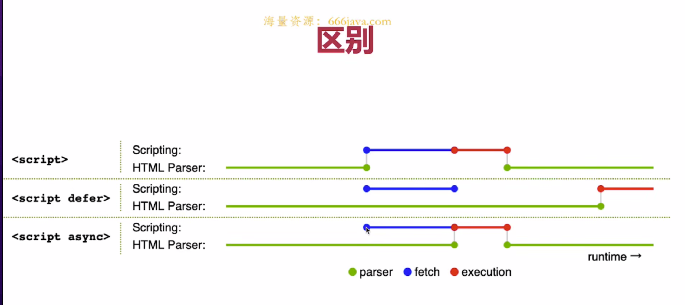

#### css,js 加载与执行

    css阻塞:
      1.css head中阻塞页面的渲染
      2.css阻塞js的执行
      3.css不阻塞外部脚本的加载
    js阻塞:
      1.直接引入的js阻塞页面的渲染
      2.js不阻塞资源的加载
      3.js顺序执行，阻塞后续js逻辑的执行
    异步加载js:
      1.动态加载
      2.defer:异步下载, 延迟执行, 在整个HTML解析完(DOMContentLoaded之前)才会执行，只针对外部脚本有效.
      3.async:异步下载, 同步执行, 下载完成后立即执行, 会阻塞其他代码执行, 只针对外部脚本有效.
    图片懒加载:
      图片进入可视区域后再加载资源
    图片预加载(再使用之前加载):
      1.使用image标签加载图片
      2.使用image对象加载图片
      3.使用XMLHTTPReuqest加载图片
      4.preload.js

#### 预加载

preload 资源在当前页面使用, 优先加载
prefetch 将来可能用到的资源, 空闲时加载

#### 浏览器重绘,回流

    回流:
      当render tree中的一部分(或全部)因为元素的规模尺寸，布局，隐藏等改变而需要重新构建。这就称为回流(reflow)当页面布局和几何属性改变时就需要回流
    触发页面重布局的属性:
      盒子模型相关属性:
      width height padding margin display border-width border min-height
      定位属性及浮动:
      top bottom left right position float clear
      改变节点内部文字结构:
      text-align overflow-y font-weight overflow font-family line-height vertival-align white-space font-size
    重绘:
      当render tree中的一些元素需要更新属性，而这些属性只是影响元素的外观，风格，而不会影响布局的，比如background-color。则就叫称为重绘
    触发重绘的属性:
      color border-style border-radius visibility text-decoration background background-image background-position background-repeat background-size outline-color outline outline-    style outline-width box-shadow

    回流必将引起重绘,而重绘不一定会引起回流

    避免重绘,回流的主要思想:
      1.避免使用导致重绘,回流的css属性
      2.将重绘,回流的影响范围限制在单独的图层内
      优化点:
      1. 用translate替代top改变
      2. 用opacity替代visibility
      3. 不要一条一条地修改 DOM 的样式，预先定义好 class，然后修改 DOM 的 className
      4. 把 DOM 离线后修改，比如：先把 DOM 给 display:none (有一次 Reflow)，然后你修改100次，然后再把它显示出来
      5. 不要把 DOM 结点的属性值放在一个循环里当成循环里的变量
      6. 不要使用 table 布局，可能很小的一个小改动会造成整个 table 的重新布局
      7. 动画实现的速度的选择
      8. 对于动画新建图层
      9. 启用 GPU 硬件加速

#### 防抖节流

防抖:
函数防抖是指在事件被触发 n 秒后再执行回调，如果在这 n 秒内事件又被触发，则重新计时。这可以使用在一些点击请求的事件上，避免因为用户的多次点击向后端发送多次请求

```javascript
function debounce(callback) {
  let time = null
  return function () {
    if (time) {
      clearTimeout(time)
      time = null
    }
    time = setTimeout(() => {
      callback()
    }, 1000)
  }
}
```

节流:
函数节流是指规定一个单位时间，在这个单位时间内，只能有一次触发事件的回调函数执行，如果在同一个单位时间内某事件被触发多次，只有一次能生效。节流可以使用在 scroll 函数的事件监听上，通过事件节流来降低事件调用的频率。

```javascript
function throttle(callback) {
  let time = null
  return function () {
    if (!time) {
      time = setTimeout(() => {
        callback()
        clearTimeout(time)
        time = null
      }, 1000)
    }
  }
}
```

#### 浏览器储存

    Cookie:
      因为HTTP请求无状态，所以需要cookie去维持客户端状态
    cookie的生成方式
      1. http response header中的set-cookie
      2. js中可以通过document.cookie可以读写cookie
      仅仅作为浏览器存储（大小4KB左右，能力被localstorage替代）
      cookie中在相关域名下面 —— cdn的流量损耗
      httponly
    LocalStorage
      HTML5设计出来专门用于浏览器存储的
      大小为5M左右
      仅在客户端使用，不和服务端进行通信
      接口封装较好
      浏览器本地缓存方案
    SessionStorage
      会话级别的浏览器存储
      大小为5M左右
      仅在客户端使用，不和服务端进行通信
      接口封装较好
      对于表单信息的维护
    IndexedDB
      IndexedDB 是一种低级API，用于客户端存储大量结构化数据。该API使用索引来实现对该数据的高性能搜索。虽然 Web Storage 对于存储较少量的数据很有用，但对于存储更大量的结构化数据来     说，这种方法不太有用。IndexedDB提供了一个解决方案。为应用创建离线版本

    PWA
      PWA (Progressive Web Apps) 是一种 Web App 新模型，并不是具体指某一种前沿的技术或者某一个单一的知识点，我们从英文缩写来看就能看出来，这是一个渐进式的 Web App，是通过一系列新的    Web 特性，配合优秀的 UI 交互设计，逐步的增强 Web App 的用户体验。
      可靠：在没有网络的环境中也能提供基本的页面访问，而不会出现“未连接到互联网”的页面。
      快速：针对网页渲染及网络数据访问有较好优化。
      融入（Engaging）：应用可以被增加到手机桌面，并且和普通应用一样有全屏、推送等特性。
    Service Worker
      Service Worker 是一个脚本，浏览器独立于当前网页，将其在后台运行,为实现一些不依赖页面或者用户交互的特性打开了一扇大门。在未来这些特性将包括推送消息,背景后台同步，          geofencing（地理围栏定位），但它将推出的第一个首要特性，就是拦截和处理网络请求的能力，包括以编程方式来管理被缓存的响应。

#### 图片懒加载

```javascript
// document.body.scrollTop 滚动上去的高度
// window.innerHeight 浏览器视窗高度
// img.offsetTop 图片距离 body 内边距的高度
const img = document.querySelector('.img')
window.addEventListener('scroll', function () {
  var scrollTop = document.body.scrollTop || document.documentElement.scrollTop
  var winHeight = window.innerHeight
  console.log(img.offsetTop, scrollTop + winHeight)
  if (img.offsetTop < scrollTop + winHeight) {
    img.src = img.getAttribute('data-src')
  }
})
```

```javascript
// img.getBoundingClientRect() 方法返回元素的大小及其相对于视口的位置
const img = document.querySelector('.img')
window.addEventListener('scroll', function () {
  var winHeight = window.innerHeight
  if (img.getBoundingClientRect().top < winHeight) {
    img.src = img.getAttribute('data-src')
  }
})
```

#### 使用多线程 web worker

将纯计算的工作迁移到 web worker 上处理

#### 总结

加载方面:

1. 减少 http 请求
2. 压缩文件, 缩小体积
3. CDN
4. SSR
5. 懒加载

性能问题:

1. 回流与重绘
2. 脱离文档流(定位, 浮动, transform, fragement)

#### defer & async


